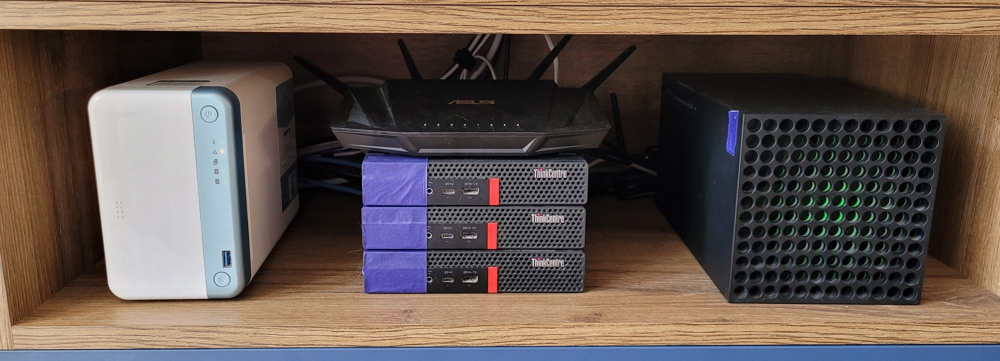

# Hardware

## Rack

I don't have any specialistic rack, just some space :D

## List

There is list of devices that are used in my home

| Device                     | Count | Purpose                           |
| -------------------------- | ----- | --------------------------------- |
| Huawei ONT (Orange)        | 1     | ISP                               |
| ASUS RT-AX58U              | 1     | Router                            |
| Lenovo M720q USFF i5-8600T | 3     | K8S cluster                       |
| RPI 4 model B              | 1     | Stopped (2026-10-04): Home Assistant, AdGuard Home and the add-ons now run in the cluster; retained until 2026-10-17 |
| NETGEAR GS108GE                             | 1 | 8-port unmanaged 1 GbE switch (router + k8s nodes + QNAP) |
| CyberPower CP1350EPFCLCD                    | 1 | UPS 1350VA/810W, 6x Schuko, AVR; USB to the QNAP (NUT server, `qnapups`) |
| QNAP TS-251D (8 GB RAM, QM2-2P10G1TA PCIe) | 1 | Storage (NFS + S3) |
