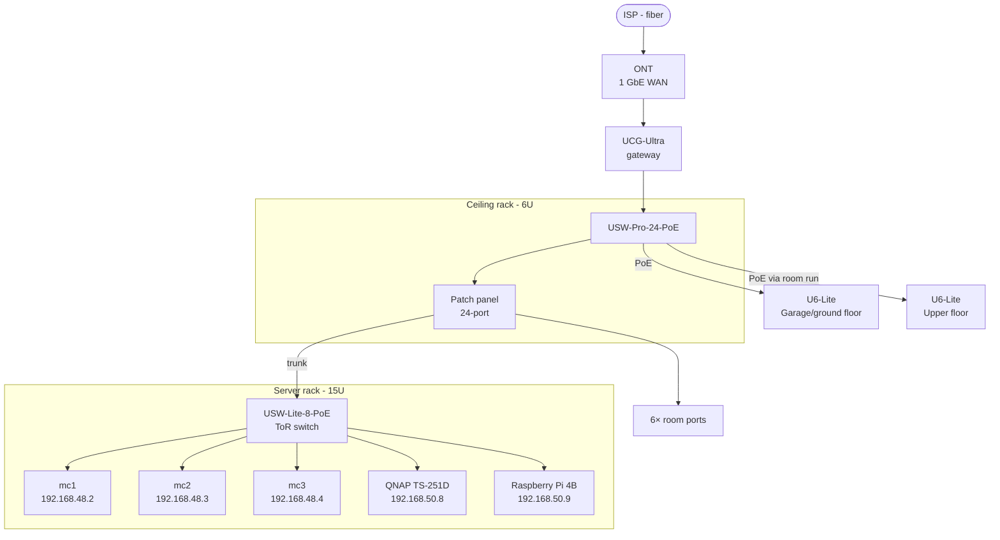

# Network Upgrade Plan — New Home

Migration from current flat home network to a rack-based UniFi setup with proper VLAN segmentation.

## Goals

- Rack-mounted networking gear in existing ceiling-mounted 6U garage rack
- Proper VLAN segmentation (cluster, servers, trusted, IoT)
- K8s cluster and NAS in new floor-standing 15U garage rack (Lanberg FF01-6615-23B)
- 2× UniFi APs for full house WiFi coverage (2 floors)
- Retain existing IP/subnet scheme to avoid Talos reconfiguration
- UPS protection for both racks

---

## Hardware

### New Purchases

| Item | Est. price (PLN) |
|------|-----------------|
| UniFi Cloud Gateway Ultra (UCG-Ultra) | ~464 |
| UniFi USW-Pro-24-PoE | ~2,799 |
| UniFi USW-Lite-8-PoE (server rack ToR) | ~530 |
| UniFi U6-Lite × 2 | ~1,210 |
| [Lanberg FF01-6615-23B](https://www.komputronik.pl/product/1002234/lanberg-szafa-rack-stojaca-19-15u-600x600-czarna-drzwi-perforowane.html) (15U, 600×600mm, perforated steel front+rear, built-in 2-fan panel, 800kg top) | 1,069 |
| [Lanberg AK-1002-B](https://www.morele.net/szuflada-rack-lanberg-1u-ak-1002-b-6602609/) 1U shelf × 3 (UCG-Ultra, QNAP NAS, Raspberry Pi) | ~141 |
| M5×12mm screws × 6 + M5 hex nuts × 6 (for 3D-printed M720q rack tray) | ~10 |
| [Lanberg PDU-08E-0200-BK](https://www.szafa-rackowa.pl/LISTWA-ZASILAJACA-RACK-PDU-19-LANBERG-1U-16A-8X-230V-PL-2M-CZARNA-113765.html) 1U PDU (16A, 8× Schuko, surge protection, 2m) × 2 | ~164 |
| BKK 40×25mm cable channel 2m × 2 + accessories (end caps, corner pieces, wall anchors) | ~35 |
| 3m Schuko extension cable (CP550EFCLCD → ceiling rack PDU, runs in trunking) | ~25 |
| CAT6 patch cables: 0.5m × 14 (in-rack), 1m × 7 (AP1 + 6 room ends), 5m × 1 (inter-rack trunk) | ~200 |
| CP550EFCLCD replacement battery (12V 7Ah SLA) | ~70 |
| **Total** | **~6,717** |
| TP-Link TL-SG105 unmanaged switch (optional, per room needing extra ports) | ~60 each |

### Already Owned (no cost)

| Device | Purpose |
|--------|---------|
| 3× Lenovo M720q | K8s cluster nodes |
| QNAP TS-251D (QM2-2P10G1TA) | NFS + S3 storage |
| Raspberry Pi 4B | HAOS + AdGuard Home |
| CyberPower CP1350EPFCLCD | Server rack UPS |
| CyberPower CP550EFCLCD | Networking rack UPS (battery replacement needed) |
| 6U ceiling-mounted rack | Networking rack (existing) |
| 24-port CAT6 patch panel | Ceiling rack patch panel |
| 2× outdoor IP camera (RTSP) | Security cameras (Frigate NVR) |

---

## Network Design

### Physical Topology



### VLANs

| VLAN | ID | Subnet | Purpose | Internet | Inter-VLAN |
|------|----|--------|---------|----------|------------|
| Trusted | 10 | `192.168.10.x` | PCs, phones, consoles, TVs | ✅ | → 20, 30 |
| Cluster | 20 | `192.168.48.x` | K8s nodes (existing subnet) | ✅ | ↔ 30 |
| Servers | 30 | `192.168.50.x` | QNAP, RPi (existing subnet) | ✅ | ↔ 20 |
| IoT | 40 | `192.168.40.x` | Smart home devices | ✅ | ❌ |
| Guest | 50 | `192.168.60.x` | Guest WiFi | ✅ | ❌ |

Existing subnets (`192.168.48.x` and `192.168.50.x`) are kept — no Talos, QNAP, or RPi reconfiguration needed.

### Firewall Rules (UCG-Ultra)

| Rule | Action |
|------|--------|
| VLAN 20 ↔ VLAN 30 | Allow (NFS, AdGuard DNS) |
| VLAN 10 → VLAN 20 (192.168.48.21) | Allow (envoy-internal access) |
| VLAN 10 → VLAN 30 (192.168.50.9 :53) | Allow (AdGuard DNS) |
| IoT (40) → any VLAN | Deny |
| Guest (50) → any VLAN | Deny |

### USW-Lite-8-PoE Port Assignment

| Port | Device | VLAN mode |
|------|--------|-----------|
| 1 | Uplink → patch panel port 7 | Trunk (VLAN 20 + 30 tagged) |
| 2 | mc1 | Access VLAN 20 |
| 3 | mc2 | Access VLAN 20 |
| 4 | mc3 | Access VLAN 20 |
| 5 | QNAP | Access VLAN 30 |
| 6 | RPi | Access VLAN 30 |
| 7–8 | spare | — |

### Patch Panel Port Assignment

| Ports | Purpose |
|-------|---------|
| 1–6 | Room runs (6 rooms) |
| 7 | Server rack trunk (USW-Lite-8-PoE uplink) |
| 8–24 | Spare |

### Room Expansion

Rooms needing more than 1 port get a **TP-Link TL-SG105** (~60 PLN) locally. One patch cable from the core switch feeds it, giving 4 extra ports. No PoE or managed features needed.

---

## Rack Layouts

### Networking Rack (6U, ceiling-mounted)

```
┌─────────────────────────────┐
│ 1U  24-port patch panel     │
│ 1U  USW-Pro-24-PoE          │
│ 1U  shelf — UCG-Ultra       │
│ 1U  PDU (PDU-08E-0200-BK)   │
│ 1U  blanking panel          │
│ 1U  blanking panel          │
└─────────────────────────────┘
⬛ CP550EFCLCD (floor below rack)
     ↕ power cable up wall
```

> **Operational note**: this rack is ceiling-mounted and requires a ladder for physical access.
> UCG-Ultra and USW-Pro-24-PoE are fully remote-managed via UniFi — treat as set-and-forget.
> Only go up to swap a failed device or add a cable.

### Server Rack (15U, floor-standing — Lanberg FF01-6615-23B)

```
┌─────────────────────────────┐  ← TOP (exhaust)
│ 1U  built-in fan panel      │  hot air out ↑  [FF01-6615-23B integrated]
│ 7U  spare / future          │
│ 1U  USW-Lite-8-PoE (rack ears)│  ~10W
│ 2U  3× M720q (3D-printed tray)│  ~90–195W  ← main heat source
│ 2U  QNAP TS-251D (1U shelf)  │  ~20–30W
│ 1U  RPi (1U shelf)           │  ~5W
│ 1U  PDU (PDU-08E-0200-BK)   │  no heat
└─────────────────────────────┘  ← BOTTOM (cool air in)
⬛ CP1350EPFCLCD (floor beside rack)
     USB → RPi (NUT master)
```

> **Airflow**: cool air enters through the vented front door at the bottom, rises past M720q and
> QNAP (which have their own rear-exhaust fans), and is actively pulled out by the 1U fan panel
> at the top. PDU and RPi sit at the bottom where heat load is minimal. Spare U-space is placed
> above the active gear so future additions don't disrupt the airflow stack.

> **M720q mounting**: three M720q fit side by side in a 2U space with a 3D-printed rack tray.
> Free model: [Lenovo ThinkCentre Tiny M720Q/M715Q/M920Q 19-inch Rack Mount](https://www.printables.com/model/1360667-lenovo-thinkcentre-tiny-m720qm715qm920q-19-inch-ra)
> by Mixmeister on Printables (3MF + STL, free). Assembled with 6× M5 screws + 6× M5 hex nuts.
> The tray is multi-section — verify part dimensions fit the A1 Mini (180×180×180mm) before printing.

> **Why 15U (FF01-6615-23B)**: Lanberg's smallest floor-standing enclosed model — 12U
> doesn't exist in their floor-standing range. The 3 extra U gives 7U of spare space for future
> expansion. Built-in 2-fan panel and perforated steel doors mean no extra fan hardware needed.

> **Rack top**: the FF01-6615-23B's steel top (rated 800 kg) doubles as a shelf for a
> **Bambu Lab A1 Mini + AMS Lite** (~16 kg combined). 600×600mm footprint fits the printer
> (347×389mm) comfortably.

### Inter-Rack Cabling

| Cable | From | To | Notes |
|-------|------|----|-------|
| 1× CAT6 (trunk) | Patch panel port 7 | USW-Lite-8-PoE port 1 | VLAN 20+30 tagged |
| 1× power | CP550EFCLCD | Networking rack PDU | Run in wall trunking |
| 1× USB (optional) | RPi | CP550EFCLCD | NUT monitoring of networking UPS |

All inter-rack cables routed in 40×25mm surface cable trunking along garage wall.

---

## Design Decisions

| Decision | Choice | Rationale |
|----------|--------|-----------|
| UCG-Ultra vs UDM-SE | UCG-Ultra | Already buying USW-Pro-24-PoE. UDM-SE has a built-in 8-port PoE switch but would still need USW-Pro for 24 ports — two devices drawing ~100W+ vs ~60W for UCG-Ultra + USW-Pro. Power-efficient split wins. UDM-SE would be needed for UniFi Protect (cameras) — ruled out in favour of Frigate on K8s (see below). |
| Coral TPU vs Intel OpenVINO | OpenVINO | M720q nodes have Intel UHD 630 iGPU. Frigate's OpenVINO detector uses it for hardware-accelerated inference — no extra hardware needed for 2 cameras. |
| Server rack model | Lanberg FF01-6615-23B (15U) | Smallest Lanberg floor-standing enclosed model. 3 extra U over 12U gives 7U spare. Perforated steel doors, 2-fan panel built in, 800 kg top panel — no separate fan panel needed. 1,069 PLN (Komputronik). |
| Individual runs vs ToR switch | Managed ToR (USW-Lite-8-PoE) | VLANs require per-port tagging in the server rack. Unmanaged ToR can't do this; individual runs would mean 5 cables between racks. One trunk cable + managed ToR is cleaner. |
| QNAP 10G to cluster | Not direct | QNAP is on VLAN 30 (servers), cluster is on VLAN 20. Routed via UCG-Ultra, same as current setup. No dedicated passthrough needed for home lab workloads. |

---

## Security Cameras

2 IP cameras planned. Running **Frigate NVR** as a K8s workload rather than UniFi Protect, for the following reasons:

- UCG-Ultra does not support UniFi Protect — adding it would require UDM-SE (~1,650 PLN more) or a dedicated UNVR (~1,100 PLN)
- K8s cluster is already running — Frigate fits naturally as another workload
- Frigate integrates natively with Home Assistant via the Frigate integration
- Any RTSP-capable camera works (Reolink, Hikvision, Dahua) — cheaper than UniFi cameras (~200–400 PLN vs ~500–700 PLN each)
- Recording stored locally on QNAP via NFS

### Camera placement

| Camera | Location | Purpose |
|--------|----------|---------|
| #1 | TBD | TBD |
| #2 | TBD | TBD |

### Network

Cameras go on **VLAN 40 (IoT)** — isolated from trusted devices and cluster. Frigate (running in the cluster on VLAN 20) needs access to camera streams:

- Add firewall rule: VLAN 20 → VLAN 40 (RTSP port 554) allow
- Cameras have no outbound internet access (IoT VLAN default deny)

### Object detection

Frigate uses **Intel OpenVINO** as the detector, running on the iGPU already present in the M720q nodes (Intel UHD 630). No additional hardware needed for 2 cameras.

---

## AP Placement

| AP | Location | Coverage |
|----|----------|----------|
| U6-Lite #1 | Garage / next to networking rack (center ground floor) | Ground floor + garden |
| U6-Lite #2 | Upper floor ceiling center | Upper floor |

Both powered via PoE from USW-Pro-24-PoE. AP #1 connects directly to switch (no room run needed). AP #2 uses one of the 6 room runs.

---

## Power Consumption

### Per-device estimates

| Device | Idle | Load |
|--------|------|------|
| UCG-Ultra | 12W | 12W |
| USW-Pro-24-PoE (base) | 30W | 30W |
| 2× U6-Lite (PoE) | 18W | 18W |
| USW-Lite-8-PoE | 10W | 10W |
| 3× M720q | 90W | 195W |
| QNAP TS-251D | 20W | 30W |
| Raspberry Pi 4B | 5W | 7W |
| **Total** | **~185W** | **~302W** |

### Annual cost estimate

At ~200W average continuous and ~0.80 PLN/kWh (Polish household tariff):

| | kWh/year | Cost/year |
|-|----------|-----------|
| Networking rack (~60W) | 526 | ~421 PLN |
| Server rack (~140W avg) | 1,226 | ~981 PLN |
| **Total** | **1,752** | **~1,402 PLN** |

---

## UPS Coverage

| UPS | Rack | Devices covered | Load | Est. runtime |
|-----|------|-----------------|------|-------------|
| CP550EFCLCD (battery replaced) | Networking | UCG-Ultra, USW-Pro-24-PoE | ~60W | ~15 min |
| CP1350EPFCLCD | Server | 3× M720q, QNAP, RPi, USW-Lite-8-PoE | ~165W | ~8 min |

Both UPS units connect via USB to RPi for NUT monitoring in Home Assistant.

---

## Migration Plan

### Phase 1 — Pre-configure (days before cutover)

1. Replace CP550EFCLCD battery (12V 7Ah SLA)
2. Pre-configure UCG-Ultra offline:
   - VLANs 10/20/30/40/50 with DHCP
   - Static IPs: mc1–3 (`192.168.48.2–4`), QNAP (`192.168.50.8`), RPi (`192.168.50.9`)
   - Firewall rules (see table above)
   - WiFi SSIDs (trusted + IoT + guest)
3. Pre-configure USW-Lite-8-PoE VLAN port assignments (see table above)

### Phase 2 — Physical prep (days before cutover)

1. Mount in ceiling rack: patch panel, USW-Pro-24-PoE, UCG-Ultra shelf, PDU
2. Install wall cable trunking between ceiling rack and server rack location
3. Run 6 room CAT6 cables to patch panel (ports 1–6)
4. Run inter-rack trunk CAT6 cable (patch panel port 7 → server rack)
5. Assemble 15U server rack (shelves, PDU)
6. Place CP550EFCLCD on floor below ceiling rack, run power cable up to rack PDU

### Phase 3 — Cutover day

#### Shutdown (graceful)

```sh
# Cordon all nodes
kubectl cordon mc1 mc2 mc3

# Shutdown K8s nodes via Talos
talosctl shutdown --nodes 192.168.48.2,192.168.48.3,192.168.48.4

# Shutdown QNAP via web UI
# Shutdown RPi via Home Assistant or SSH
```

#### Physical move

1. Move 3× M720q → 15U rack, connect to USW-Lite-8-PoE ports 2–4
2. Move QNAP → 15U rack, connect to USW-Lite-8-PoE port 5
3. Move RPi → 15U rack, connect to USW-Lite-8-PoE port 6
4. Move CP1350EPFCLCD → floor beside 15U rack, connect USB to RPi
5. Connect USW-Lite-8-PoE uplink (port 1) → inter-rack trunk cable

#### Power up

1. CP550EFCLCD → networking rack PDU on
2. UCG-Ultra + USW-Pro-24-PoE come up
3. CP1350EPFCLCD → server rack PDU on
4. RPi, QNAP, mc1, mc2, mc3 power on

#### Verify

```sh
# Cluster health
kubectl get nodes

# ArgoCD sync status
argocd app list

# DNS resolution (from trusted device)
dig k8s.PRIVATE_DOMAIN @192.168.50.9

# Internal services
curl -I https://argocd.PRIVATE_DOMAIN
```

#### Finish

1. Mount U6-Lite APs (garage center + upper floor), connect via PoE
2. Verify WiFi on all VLANs
3. Decommission old gear (see below)

### Retired Gear

| Device | Status | Notes |
|--------|--------|-------|
| NETGEAR GS108GE | Retire | Replaced by USW-Pro-24-PoE + USW-Lite-8-PoE |
| ASUS RT-AX58U | **Keep as spare AP** | Supports Asuswrt-Merlin; useful as a temporary AP or coverage extender if needed |

---

### Risk Mitigation

| Risk | Mitigation |
|------|-----------|
| VLAN misconfiguration breaks cluster | Pre-configure and verify switch config before cutover day |
| K8s nodes cannot reach QNAP NFS | Firewall rule: VLAN 20 ↔ VLAN 30 must be verified first |
| AdGuard DNS unreachable from cluster | Allow VLAN 20 → VLAN 30 port 53 |
| etcd quorum loss | Shutdown all 3 nodes simultaneously, not sequentially |
| Cloudflare Tunnel drops | cloudflared reconnects automatically after nodes restart |
