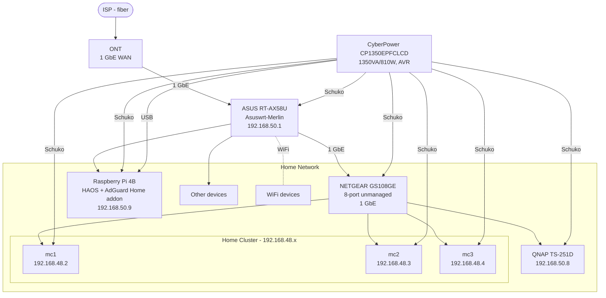

# Network

The cluster uses a single domain (PRIVATE_DOMAIN) split across two gateways — one for external access via Cloudflare, one for internal access via AdGuard Home DNS.

## Physical Topology

## Gateway Architecture

| Gateway | IP | Access | DNS | Entry point |
|---|---|---|---|---|
| `envoy-external` | 192.168.48.20 | Internet | Cloudflare | Cloudflare Tunnel (`cloudflared`) |
| `envoy-internal` | 192.168.48.21 | Home network only | AdGuard Home | Direct L2 (Cilium) |

Both gateways are implemented with [Envoy Gateway](https://gateway.envoyproxy.io/) using the Kubernetes Gateway API. TLS is terminated at the gateway using a wildcard certificate issued by cert-manager via Cloudflare DNS01 challenge.

## DNS

Two [external-dns](https://github.com/kubernetes-sigs/external-dns) controllers run in parallel, each scoped to its own gateway by annotation filter (`external-dns.alpha.kubernetes.io/controller`):

- **cloudflare-dns** — watches resources annotated `controller: external`, writes records to Cloudflare DNS (proxied). Sources: `DNSEndpoint` CRDs + `gateway-httproute` from `envoy-external`.
- **adguard-dns** — watches resources annotated `controller: internal`, writes records to AdGuard Home on the RPI (192.168.50.9). Sources: `DNSEndpoint` CRDs + `gateway-httproute` from `envoy-internal`.

### Internal DNS records (AdGuard Home)

Static records are defined as `DNSEndpoint` CRDs in `cluster/apps/system/adguard-dns/templates/dnsendpoints.yaml`:

| Record | Type | Target | Purpose |
|---|---|---|---|
| `k8s.PRIVATE_DOMAIN` | A | 192.168.48.1 | Cluster VIP (kube-apiserver) |
| `qnap.PRIVATE_DOMAIN` | A | 192.168.50.8 | QNAP NAS |

Per-app A records pointing to `192.168.48.21` are created automatically by adguard-dns external-dns
from each `HTTPRoute` annotated with `controller: dns-controller` attached to `envoy-internal`.

### External DNS records (Cloudflare)

Static records defined as `DNSEndpoint` CRDs:

| Record | Type | Target | Purpose |
|---|---|---|---|
| `haas.PRIVATE_DOMAIN` | CNAME | `external.PRIVATE_DOMAIN` | Home Assistant (HAOS on RPi) |

HTTPRoutes attached to `envoy-external` are automatically published to Cloudflare by external-dns.

## External Access via Cloudflare Tunnel

`cloudflared` runs 2 replicas in the cluster and connects to Cloudflare's network. Incoming requests from the internet are routed by Cloudflare to the `envoy-external` gateway. No ports need to be forwarded on the home router.

## UPS & Power Management

A **CyberPower CP1350EPFCLCD** (1350VA/810W, AVR) protects all critical devices: router, switch, RPi, all 3 k8s nodes, and QNAP NAS.

The UPS is connected via USB to the RPi, which runs the **NUT Server** Home Assistant addon as the NUT master. The k8s nodes and QNAP act as NUT clients (slaves) and shut down gracefully on battery-low events.

| Role | Device |
|------|--------|
| NUT master (USB) | RPi — HAOS NUT Server addon |
| NUT slave | mc1, mc2, mc3 (k8s nodes) |
| NUT slave | QNAP TS-251D |

## IP Allocation

| IP | Service |
|---|---|
| `192.168.48.1` | Cluster VIP (kube-apiserver) |
| `192.168.48.20` | `envoy-external` gateway |
| `192.168.48.21` | `envoy-internal` gateway |
| `192.168.48.23` | Minecraft Bedrock |
| `192.168.48.27` | Home automation (Ollama, Whisper, Piper, OpenWakeWord) |
| `192.168.48.28` | Vintage Story |
| `192.168.50.8` | QNAP NAS |
| `192.168.50.9` | RPi — HAOS (Home Assistant OS); AdGuard Home as HA addon |
