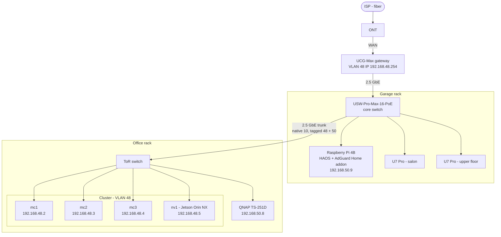

# Network

The cluster uses a single domain (PRIVATE_DOMAIN) split across two gateways — one for external access via Cloudflare, one for internal access via AdGuard Home DNS.

## Physical Topology

Two racks: a garage rack carrying the gateway, core switch and WAN, and an
office rack carrying the cluster and NAS, joined by a single tagged trunk.

```mermaid
flowchart TB
    ISP([ISP - fiber])
    ONT[ONT]
    UCG[UCG-Max gateway\nVLAN 48 IP 192.168.48.254]

    subgraph GAR[Garage rack]
        SW[USW-Pro-Max-16-PoE\ncore switch]
        RPi[Raspberry Pi 4B\nHAOS + AdGuard Home addon\n192.168.50.9]
        AP1[U7 Pro - salon]
        AP2[U7 Pro - upper floor]
    end

    subgraph OFF[Office rack]
        ToR[ToR switch]
        QNAP[QNAP TS-251D\n192.168.50.8]

        subgraph K8S[Cluster - VLAN 48]
            mc1[mc1\n192.168.48.2]
            mc2[mc2\n192.168.48.3]
            mc3[mc3\n192.168.48.4]
            nv1[nv1 - Jetson Orin NX\n192.168.48.5]
        end
    end

    ISP --> ONT
    ONT -->|WAN| UCG
    UCG -->|2.5 GbE| SW
    SW --> RPi
    SW --> AP1
    SW --> AP2
    SW -->|2.5 GbE trunk\nnative 10, tagged 48 + 50| ToR
    ToR --> mc1
    ToR --> mc2
    ToR --> mc3
    ToR --> nv1
    ToR --> QNAP
```

## VLANs

VLAN ID always equals the third octet of the subnet. The gateway is the
UCG-Max on every VLAN.

| Network | VLAN | Subnet | Gateway | Purpose |
|---|---|---|---|---|
| Trusted | *untagged* | `192.168.10.0/24` | `.1` | PCs, phones, consoles, TVs |
| IoT | 40 | `192.168.40.0/24` | `.1` | Smart home + cameras |
| Cluster | 48 | `192.168.48.0/24` | **`.254`** | Talos nodes |
| Servers | 50 | `192.168.50.0/24` | `.1` | QNAP, RPi |
| Guest | 60 | `192.168.60.0/24` | `.1` | Guest WiFi |

> **VLAN 48's gateway is `.254`, not `.1`.** `192.168.48.1` is the Talos
> shared control-plane VIP (`k8s.PRIVATE_DOMAIN`, see below) and predates the
> network build. Putting the UCG-Max on `.1` would collide with it. This is
> the one deliberate exception to the "gateway is `.1`" convention.

Cluster and Servers sit in a shared `Infra` firewall zone with intra-zone
allow-all, so the nodes reach the QNAP (NFS) and AdGuard (DNS) on VLAN 50
with no explicit policy. DHCP is disabled on VLAN 48 — every node address is
static in its Talos config.

> **Every static host must use a `/24` mask.** These subnets were once one
> flat `192.168.48.0/22`. A host left on `/22` treats `192.168.48.0`–
> `192.168.51.255` as on-link and ARPs for off-VLAN peers instead of routing
> to them, so traffic works one way and replies vanish — and only for peers
> that fall inside the stale range, which makes it look like a firewall rule.
> This bit the Talos nodes, the RPi and the QNAP during the migration.

## Gateway Architecture

| Gateway | IP | Access | DNS | Entry point |
|---|---|---|---|---|
| `envoy-external` | 192.168.48.20 | Internet | Cloudflare | Cloudflare Tunnel (`cloudflared`) |
| `envoy-internal` | 192.168.48.21 | Home network only | AdGuard Home | Direct L2 (Cilium) |

Both gateways are implemented with [Envoy Gateway](https://gateway.envoyproxy.io/) using the Kubernetes Gateway API. TLS is terminated at the gateway using a wildcard certificate issued by cert-manager via Cloudflare DNS01 challenge.

## DNS

Two [external-dns](https://github.com/kubernetes-sigs/external-dns) controllers run in parallel, each scoped to its own gateway by annotation filter (`external-dns.alpha.kubernetes.io/controller`):

- **cloudflare-dns** — watches resources annotated `controller: external`, writes records to Cloudflare DNS (proxied). Sources: `DNSEndpoint` CRDs + `gateway-httproute` from `envoy-external`.
- **adguard-dns** — watches resources annotated `controller: internal`, writes records to AdGuard Home on the RPI (192.168.50.9). Sources: `DNSEndpoint` CRDs + `gateway-httproute` from `envoy-internal`.

### Internal DNS records (AdGuard Home)

Static records are defined as `DNSEndpoint` CRDs in `cluster/apps/system/adguard-dns/templates/dnsendpoints.yaml`:

| Record | Type | Target | Purpose |
|---|---|---|---|
| `k8s.PRIVATE_DOMAIN` | A | 192.168.48.1 | Cluster VIP (kube-apiserver) |
| `qnap.PRIVATE_DOMAIN` | A | 192.168.50.8 | QNAP NAS |

Per-app A records pointing to `192.168.48.21` are created automatically by adguard-dns external-dns
from each `HTTPRoute` annotated with `controller: dns-controller` attached to `envoy-internal`.

### External DNS records (Cloudflare)

Static records defined as `DNSEndpoint` CRDs:

| Record | Type | Target | Purpose |
|---|---|---|---|
| `haas.PRIVATE_DOMAIN` | CNAME | `external.PRIVATE_DOMAIN` | Home Assistant (HAOS on RPi) |

HTTPRoutes attached to `envoy-external` are automatically published to Cloudflare by external-dns.

## External Access via Cloudflare Tunnel

`cloudflared` runs 2 replicas in the cluster and connects to Cloudflare's network. Incoming requests from the internet are routed by Cloudflare to the `envoy-external` gateway. No ports need to be forwarded on the home router.

## IP Allocation

Cilium LB IP pool: `192.168.48.20–50`. When adding a new `LoadBalancer` service, pick an unused IP from this range and annotate with `lbipam.cilium.io/ips: "192.168.48.XX"`.

| IP | Service |
|---|---|
| `192.168.48.1` | Cluster VIP (kube-apiserver) |
| `192.168.48.2` | mc1 — control plane node |
| `192.168.48.3` | mc2 — control plane node |
| `192.168.48.4` | mc3 — control plane node |
| `192.168.48.5` | nv1 — Jetson Orin NX worker |
| `192.168.48.20` | `envoy-external` gateway |
| `192.168.48.21` | `envoy-internal` gateway |
| `192.168.48.22` | Jellyfin |
| `192.168.48.23` | Minecraft Bedrock |
| `192.168.48.27` | Home automation (Ollama, Whisper, Piper, OpenWakeWord) |
| `192.168.48.28` | Vintage Story |
| `192.168.48.29` | WoW (auth + world server) |
| `192.168.48.30` | anytype any-sync services |
| `192.168.48.254` | UCG-Max — VLAN 48 gateway, also the nodes' NTP source |
| `192.168.50.8` | QNAP NAS |
| `192.168.50.9` | RPi — HAOS (Home Assistant OS); AdGuard Home as HA addon |
