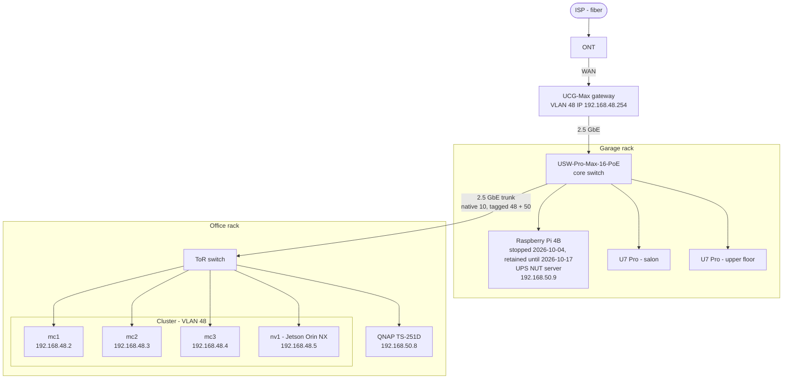

# Network

The cluster uses a single domain (PRIVATE_DOMAIN) split across two gateways — one for external access via Cloudflare, one for internal access via AdGuard Home DNS.

## Physical Topology

Two racks: a garage rack carrying the gateway, core switch and WAN, and an
office rack carrying the cluster and NAS, joined by a single tagged trunk.


```mermaid
flowchart TB
    ISP([ISP - fiber])
    ONT[ONT]
    UCG[UCG-Max gateway\nVLAN 48 IP 192.168.48.254]

    subgraph GAR[Garage rack]
        SW[USW-Pro-Max-16-PoE\ncore switch]
        RPi[Raspberry Pi 4B\nstopped 2026-10-04, retained until 2026-10-17\nUPS NUT server\n192.168.50.9]
        AP1[U7 Pro - salon]
        AP2[U7 Pro - upper floor]
    end

    subgraph OFF[Office rack]
        ToR[ToR switch]
        QNAP[QNAP TS-251D\n192.168.50.8]

        subgraph K8S[Cluster - VLAN 48]
            mc1[mc1\n192.168.48.2]
            mc2[mc2\n192.168.48.3]
            mc3[mc3\n192.168.48.4]
            nv1[nv1 - Jetson Orin NX\n192.168.48.5]
        end
    end

    ISP --> ONT
    ONT -->|WAN| UCG
    UCG -->|2.5 GbE| SW
    SW --> RPi
    SW --> AP1
    SW --> AP2
    SW -->|2.5 GbE trunk\nnative 10, tagged 48 + 50| ToR
    ToR --> mc1
    ToR --> mc2
    ToR --> mc3
    ToR --> nv1
    ToR --> QNAP
```

## VLANs

VLAN ID always equals the third octet of the subnet. The gateway is the
UCG-Max on every VLAN.

| Network | VLAN | Subnet | Gateway | Purpose |
|---|---|---|---|---|
| Trusted | *untagged* | `192.168.10.0/24` | `.1` | PCs, phones, consoles, TVs |
| IoT | 40 | `192.168.40.0/24` | `.1` | Smart home + cameras |
| Cluster | 48 | `192.168.48.0/24` | **`.254`** | Talos nodes |
| Servers | 50 | `192.168.50.0/24` | `.1` | QNAP, RPi |
| Guest | 60 | `192.168.60.0/24` | `.1` | Guest WiFi |

> **VLAN 48's gateway is `.254`, not `.1`.** `192.168.48.1` is the Talos
> shared control-plane VIP (`k8s.PRIVATE_DOMAIN`, see below) and predates the
> network build. Putting the UCG-Max on `.1` would collide with it. This is
> the one deliberate exception to the "gateway is `.1`" convention.

Cluster and Servers sit in a shared `Infra` firewall zone with intra-zone
allow-all, so the nodes reach the QNAP (NFS) and AdGuard (DNS) on VLAN 50
with no explicit policy. DHCP is disabled on VLAN 48 — every node address is
static in its Talos config.

> **Every static host must use a `/24` mask.** These subnets were once one
> flat `192.168.48.0/22`. A host left on `/22` treats `192.168.48.0`–
> `192.168.51.255` as on-link and ARPs for off-VLAN peers instead of routing
> to them, so traffic works one way and replies vanish — and only for peers
> that fall inside the stale range, which makes it look like a firewall rule.
> This bit the Talos nodes, the RPi and the QNAP during the migration.

## Gateway Architecture

| Gateway | IP | Access | DNS | Entry point |
|---|---|---|---|---|
| `envoy-external` | 192.168.48.20 | Internet | Cloudflare | Cloudflare Tunnel (`cloudflared`) |
| `envoy-internal` | 192.168.48.21 | Home network only | AdGuard Home | Direct L2 (Cilium) |

Both gateways are implemented with [Envoy Gateway](https://gateway.envoyproxy.io/) using the Kubernetes Gateway API. TLS is terminated at the gateway using a wildcard certificate issued by cert-manager via Cloudflare DNS01 challenge.

## DNS

Two [external-dns](https://github.com/kubernetes-sigs/external-dns) controllers run in parallel, each scoped to its own gateway by annotation filter (`external-dns.alpha.kubernetes.io/controller`):

- **cloudflare-dns** — watches resources annotated `controller: external`, writes records to Cloudflare DNS (proxied). Sources: `DNSEndpoint` CRDs + `gateway-httproute` from `envoy-external`.
- **adguard-dns** — watches resources annotated `controller: internal`, writes records to the in-cluster AdGuard Home primary (via `https://agh.PRIVATE_DOMAIN/control`; `adguard-home-sync` copies them to the replica). Sources: `DNSEndpoint` CRDs + `gateway-httproute` from `envoy-internal`.

### DNS flow

- **Clients:** every VLAN's DHCP hands out `192.168.48.25` and `192.168.48.31` (both AdGuard Home instances, both blocking). The UCG-Max is deliberately not a client resolver: clients do not reliably prefer the first server, and the UCG-Max knows no internal names and blocks nothing. IPv6 DNS uses the two ULAs below.
- **AdGuard upstreams / reverse lookups:** the UCG-Max (`192.168.48.254`) answers reverse lookups for local clients.
- **Nodes and pods:** see "Resolver chain for cluster pods and nodes" below.

### Internal DNS records (AdGuard Home)

Static records are defined as `DNSEndpoint` CRDs in `cluster/apps/system/adguard-dns/templates/dnsendpoints.yaml`:

| Record | Type | Target | Purpose |
|---|---|---|---|
| `k8s.PRIVATE_DOMAIN` | A | 192.168.48.1 | Cluster VIP (kube-apiserver) |
| `qnap.PRIVATE_DOMAIN` | A | 192.168.50.8 | QNAP NAS |

Per-app A records pointing to `192.168.48.21` are created automatically by adguard-dns external-dns
from each `HTTPRoute` annotated with `controller: dns-controller` attached to `envoy-internal`.

### Resolver chain for cluster pods and nodes

Nodes resolve through `192.168.48.25` and `.31` (the two AdGuard instances), then `192.168.48.254` (UCG-Max)
as a last resort (see `provision/talos/templates/controlplane.yaml`). The UCG-Max knows no internal-only names
and blocks nothing, so it must never be picked while AdGuard is up.

CoreDNS is not deployed by Talos (`cluster.coreDNS.disabled: true`) and Talos offers no Corefile customisation,
so it is deployed by ArgoCD from the upstream `coredns` Helm chart (`cluster/apps/system/coredns/`), as the Talos maintainers recommend. The kubelet `clusterDNS` is pinned to the `kube-dns` Service IP `10.96.0.10` in the Talos templates. The `forward . /etc/resolv.conf` block uses
`policy sequential`; the default `random` sent about a third of pod queries to the UCG-Max, which broke internal
names and ad blocking. CoreDNS reads the node resolver list only at pod start, so restart it after changing
node nameservers.

### IPv6 DNS for AdGuard

The cluster is IPv4-only, so the DNS LoadBalancers cannot be dual-stack. Each AdGuard pod instead gets a second,
IPv6-only macvlan interface (`vlan48-v6` NetworkAttachmentDefinition, static address) and listens on it:

| Instance | IPv6 address |
|---|---|
| primary | `fd80:c04a:5687:48::25` |
| replica | `fd80:c04a:5687:48::31` |

No `bind_hosts` change is needed: AdGuard's `0.0.0.0` listener is dual-stack on the pod's sockets (`:::53`), so it
answers on the macvlan address as soon as the interface exists. Verified by querying `fd80:c04a:5687:48::25` from another
VLAN 48 pod (answers resolve, ad domains return `0.0.0.0`). Set both addresses as the manual IPv6 DNS servers in UniFi.
The pod gets an extra SLAAC address and the RA default route on `net1` as well; both are harmless.

### External DNS records (Cloudflare)

There are no static external records any more (the old `haas.PRIVATE_DOMAIN` CNAME was removed). Everything is published from `HTTPRoute`s.

HTTPRoutes attached to `envoy-external` are automatically published to Cloudflare by external-dns.

## External Access via Cloudflare Tunnel

`cloudflared` runs 2 replicas in the cluster and connects to Cloudflare's network. Incoming requests from the internet are routed by Cloudflare to the `envoy-external` gateway. No ports need to be forwarded on the home router.

## IP Allocation

This is the single source of truth for addresses on VLAN 48. **Update it in the same PR that assigns or moves an address**, and run the checks below *before* picking one: the docs have been wrong about free addresses before.

### Ranges on VLAN 48 (`192.168.48.0/24`)

| Range | Use |
|---|---|
| `.1` | Control-plane VIP (kube-apiserver) |
| `.2`–`.5` | Nodes (static in `provision/talos/nodes/`) |
| `.6`–`.19` | Unused |
| `.20`–`.50` | Cilium LoadBalancer pool `pool` |
| `.51`–`.59` | Cilium LoadBalancer pool `coder-pool` (Coder workspace SSH services) |
| `.60`–`.69` | Static addresses for pods with a Multus macvlan `net1` interface. **Outside every LB pool**; not known to Cilium, so a clash is silent |
| `.70`–`.253` | Unused |
| `.254` | UCG-Max, VLAN 48 gateway (also the nodes' NTP source and DNS resolver) |

Cilium LB IPAM (`cluster/apps/core/cilium/templates/config.yaml`) has two pools and **neither has a `serviceSelector`**, so a `LoadBalancer` service without a fixed IP can draw an address from either pool. Always set a fixed IP with `lbipam.cilium.io/ips: "192.168.48.XX"`; services that deliberately share an IP also set `lbipam.cilium.io/sharing-key`. `coder-pool` used to span `.51–.70`, which overlapped the macvlan range; it now stops at `.59` so an auto-assigned address can never land on a pod-owned one.

### Allocations

| IP | Used by |
|---|---|
| `192.168.48.1` | Cluster VIP (kube-apiserver) |
| `192.168.48.2` | mc1, control plane node |
| `192.168.48.3` | mc2, control plane node |
| `192.168.48.4` | mc3, control plane node |
| `192.168.48.5` | nv1, Jetson Orin NX worker |
| `192.168.48.20` | `envoy-external` gateway |
| `192.168.48.21` | `envoy-internal` gateway |
| `192.168.48.22` | Jellyfin |
| `192.168.48.23` | Minecraft Bedrock |
| `192.168.48.24` | `alloy-router-syslog` (monitoring: router syslog receiver) |
| `192.168.48.25` | AdGuard Home primary (DNS, live; IPv6 `fd80:c04a:5687:48::25`) |
| `192.168.48.26` | MQTT broker (Mosquitto, `mqtt.PRIVATE_DOMAIN`) |
| `192.168.48.27` | Home automation voice services, shared (Whisper, Piper, OpenWakeWord) |
| `192.168.48.28` | Vintage Story |
| `192.168.48.29` | WoW, shared (auth and world server) |
| `192.168.48.30` | anytype any-sync services, shared |
| `192.168.48.31` | AdGuard Home replica (DNS, live; IPv6 `fd80:c04a:5687:48::31`) |
| `192.168.48.51`–`.55` | Coder workspace SSH services (devops, dotnet, node, mobile, researcher) |
| `192.168.48.60` | Reserved: Home Assistant (macvlan `net1`) |
| `192.168.48.61` | Matter server (macvlan `net1`, live) |
| `192.168.48.62` | Music Assistant (macvlan `net1`, live) |
| `192.168.48.69` | Reserved for temporary test pods that verify a macvlan attachment |
| `192.168.48.254` | UCG-Max, VLAN 48 gateway |
| `192.168.50.8` | QNAP NAS |
| `192.168.50.9` | RPi (HAOS), stopped. Home Assistant, AdGuard Home, MQTT, Zigbee2MQTT, Matter and Music Assistant all moved to the cluster (2026-10-02 to 2026-10-04); kept powered off until 2026-10-17. It was also the UPS NUT server the Talos nodes monitor (`qnapups@192.168.50.9`): see the open item in the Talos config before retiring it |
| `192.168.50.239` | SLZB-MR4U (Zigbee coordinator socket `:7638` and Thread border router) |

### Check before assigning an address

```sh
# every LoadBalancer IP in use (shared IPs list several services)
kubectl get svc -A --no-headers \
  -o custom-columns=IP:.status.loadBalancer.ingress[0].ip,NS:.metadata.namespace,NAME:.metadata.name \
  | awk '$1 ~ /^192\.168\.48\./' | sort -V

# every macvlan (Multus) pod address in use
kubectl get pods -A -o json | jq -r '.items[] | select(.metadata.annotations["k8s.v1.cni.cncf.io/networks"]) |
  "\(.metadata.annotations["k8s.v1.cni.cncf.io/networks"]) \(.metadata.namespace)/\(.metadata.name)"'

# the pools themselves
kubectl get ciliumloadbalancerippool -o custom-columns=NAME:.metadata.name,BLOCKS:.spec.blocks,SELECTOR:.spec.serviceSelector
```

Also grep the repo (`grep -rn "192.168.48.XX" cluster provision docs`) for static references, and ping the address from a VLAN 48 host. Anything not in the table above and not seen in these checks (a device with a static IP or a DHCP reservation in UniFi) can still clash: check UniFi's client list for the VLAN.

## MQTT and Zigbee2MQTT

The MQTT broker is Eclipse Mosquitto (`home-automation/mosquitto`, namespace `ha-mosquitto`). It is exposed on `192.168.48.26:1883` (`mqtt.PRIVATE_DOMAIN`) for LAN clients; in-cluster clients use `mosquitto.ha-mosquitto.svc.cluster.local:1883`. Users (Home Assistant, Zigbee2MQTT) come from Bitwarden and the password file is generated at pod start; messages are persisted on a PVC. It replaced RabbitMQ's MQTT plugin because RabbitMQ never sends retained messages to wildcard subscriptions, so Home Assistant lost all MQTT-discovered entities (Zigbee2MQTT devices) after every restart.

Zigbee2MQTT (`home-automation/zigbee2mqtt`, namespace `ha-zigbee2mqtt`) talks to the SLZB-MR4U Zigbee coordinator over TCP (`tcp://192.168.50.239:7638`, `zstack` adapter). Its data (`configuration.yaml`, `database.db`, coordinator backup) lives on a Ceph PVC; the Zigbee network key is part of that data and is never committed. The frontend is at `z2m.PRIVATE_DOMAIN` on `envoy-internal`. Only one Zigbee2MQTT may own the coordinator: the RPi's addon is stopped and must stay stopped.

## Pods with their own VLAN 48 address (Multus macvlan)

Some workloads need real LAN presence (mDNS, IPv6 to the Thread network, unrestricted ports to players), which a pod on the Cilium network cannot give them. They get a second interface, `net1`, a macvlan on the node's `eth0` on VLAN 48 with a static IP from the reserved block (`192.168.48.60–.69`). The cluster-side parts live in `cluster/apps/core/cilium` (`cni.exclusive: false`) and `cluster/apps/system/multus` (Multus thick plus a small DaemonSet that installs the `macvlan` and `static` CNI plugins, which Talos does not ship). The NetworkAttachmentDefinition is named `vlan48` and is defined in each consuming app's namespace; such pods are pinned to the control-plane nodes (`mc1`–`mc3`, parent interface `eth0`).

What the setup relies on (all verified from a test pod on `net1` on 2026-10-02):

- **IPv6 on VLAN 48:** UniFi Router Advertisements/SLAAC are enabled on the network, so `net1` gets a `fd80:c04a:5687:48::/64` address and a default route via the gateway. The Talos nodes also pick up addresses in that prefix; Kubernetes still reports only their IPv4 addresses as node IPs.
- **Thread network:** the UniFi static route to the OMR prefix (see `matter-thread.md`) works from VLAN 48; a traceroute from `net1` goes gateway, then the SLZB border router.
- **mDNS:** the UniFi mDNS reflector must forward the relevant services to VLAN 48 (Google Cast, Matter, Thread TREL and Spotify Connect were seen arriving; AirPlay and MeshCoP were not).
- **macvlan host isolation:** a pod's `net1` cannot talk to its own node's addresses, including a LoadBalancer IP that node announces. In-cluster consumers must use `*.svc.cluster.local` names, never LB IPs.

## Music Assistant

Music Assistant (`home-automation/music-assistant`, namespace `ha-music-assistant`) runs on a Multus macvlan `net1` at `192.168.48.62` (see the macvlan section above): upstream documents host networking as mandatory because players are discovered through mDNS/UPnP and stream from random ports, so a plain pod network is not enough. The web UI is `ma.PRIVATE_DOMAIN` on `envoy-internal` (Service port 8095); the stream server is on `192.168.48.62:8097`.

- **Library:** the QNAP export `/music` is mounted by Kubernetes (NFS volume, read-only) at `/media/music` and added in the UI as a Local filesystem provider. The RPi used MA's own in-container NFS provider, which needs `SYS_ADMIN`; that was deliberately not carried over.
- **Settings that matter behind the gateway:** set the web server's **Base URL** (`base_url`) to the public `https://ma.PRIVATE_DOMAIN` (the default, `auto`, resolves to the pod address and breaks the Home Assistant OAuth callback); `external_url` can match. **Never change the web server `bind_port`:** the Service and route target 8095, and MA stops answering. Set the stream server's `bind_ip` to `192.168.48.62`; otherwise MA hands players its pod address.
- **Login:** the restored admin was linked only to Home Assistant OAuth, so it was removed and the first admin was created on the server's `/setup` page (username/password). The Home Assistant integration's system user and token were kept.
- **Home Assistant provider:** needs the HA URL and a long-lived token (kept in the UI, not in git). Repoint it when Home Assistant itself moves into the cluster.
- **Players:** Chromecast/Shield (Google Cast) and the MacBook (AirPlay) work over the mDNS reflector. DLNA/SSDP discovery does not cross VLANs; no DLNA player is configured.
