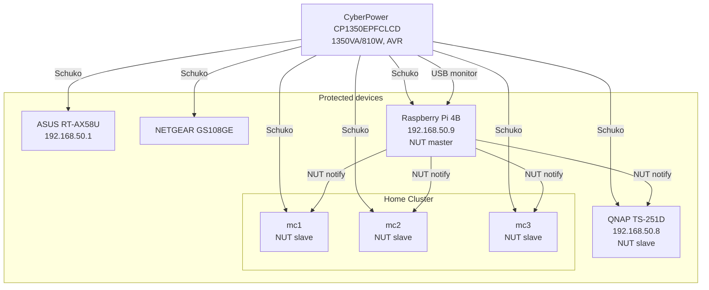

# UPS & Power Management

A **CyberPower CP1350EPFCLCD** (1350VA/810W, AVR) protects all critical devices: router, switch, RPi, all 3 k8s nodes, and QNAP NAS.

The UPS is connected via USB to the RPi, which runs the **NUT Server** Home Assistant addon as the NUT master. The k8s nodes and QNAP act as NUT clients (slaves) and shut down gracefully on battery-low events.

| Role | Device |
|------|--------|
| NUT master (USB) | RPi — HAOS NUT Server addon |
| NUT slave | mc1, mc2, mc3 (k8s nodes) |
| NUT slave | QNAP TS-251D |

